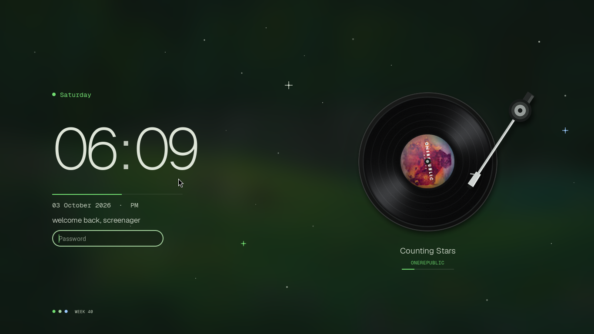

# dots

Personal setup for **CachyOS · niri · Noctalia v5 · Neovim (AstroNvim)** on a 1366×768 laptop.
Dark, compact, green-on-night, everything themed from the wallpaper.



## What's inside

| Package | Lives in | What it is |
| --- | --- | --- |
| `niri` | `~/.config/niri` | Compositor config split into `cfg/*.kdl` (keybinds, input, layout, rules, autostart). `noctalia.kdl` is regenerated by Noctalia's theme template. |
| `noctalia` | `~/.config/noctalia`, `~/.local/state/noctalia/settings.toml` | Shell config (bar, services, theme, templates) plus the GUI-edited settings, including the **Nocturne** lock-screen layout. |
| `turntable` | `~/.local/share/noctalia/plugins/turntable`, `~/.local/share/fonts/nocturne` | Custom Noctalia plugin: the spinning vinyl record with album art and swinging tonearm (lock screen), the animated clock column, and the tiny spinning disc in the bar. Ships its fonts (Geist / Geist Mono / Instrument Serif instances, OFL). |
| `nvim` | `~/.config/nvim` | AstroNvim v6. Everforest at startup, live palette swap from the wallpaper through Matugen (`SIGUSR1`), CompetiTest workflow for Codeforces/AtCoder. |
| `zsh` | `~/.zshrc`, `~/.zshenv`, `~/.p10k.zsh` | CachyOS zsh config + Powerlevel10k + zoxide. |
| `git` | `~/.gitconfig`, `~/.config/git/ignore` | Identity and `gh` credential helper. No tokens are stored. |
| `terminals` | Alacritty, Kitty, Ghostty | Terminal configs. Colour themes are generated by Noctalia and are not tracked. |
| `tools` | fastfetch, btop, cava, MangoHud | Small tool configs. |
| `cp` | `~/CP/lib` | Competitive-programming template and `debug.h`, used by CompetiTest. |
| `extras/` | not installed | Optional bits to try: `extras/niri/nocturne.kdl` (morph open/close shaders, springy animations, gradient focus ring). |

## Fresh install

```sh
git clone https://github.com/Tejas242/dots ~/dots
cd ~/dots
./install.sh --deps      # pacman + AUR packages, then copies every package into $HOME
```

Then log out and back in. On the first start:

1. **Noctalia** regenerates its colour templates (`noctalia.kdl`, terminal themes, `nvim/lua/matugen.lua`) from the wallpaper.
2. **Neovim** bootstraps lazy.nvim and installs plugins on first launch (`nvim`, then wait for Lazy to finish).
3. **Wallpaper**: the settings point at `~/Pictures/Wallpapers/aesthetic-wallpapers-main/images/`. Clone your wallpaper collection there, or pick a new one in Noctalia's settings.
4. The **Turntable** plugin is enabled in `settings.toml`. It needs `python-pillow` and `python-numpy` (installed by `--deps`), plus `busctl`, which comes with systemd.

Install only some packages with `./install.sh nvim zsh`.

`install.sh` **copies** files instead of symlinking, because Noctalia rewrites `settings.toml` atomically, which would replace a symlink. Anything it would overwrite is moved to `~/.dots-backup/<timestamp>/` first.

## Keeping the backup current

Edit configs where they live, then pull them into the repo:

```sh
cd ~/dots
./sync.sh            # or: ./sync.sh nvim noctalia
git add -A && git commit -m "sync" && git push
```

`sync.sh` holds the list of tracked paths (the `PACKAGES` table). Add a path there to start tracking it.

## The lock screen

The **Nocturne** lock screen is laid out by `turntable/.../tools/nocturne_layout.py`, which rewrites the `[lockscreen]` and `[lockscreen_widgets]` sections of `settings.toml`:

```sh
python3 ~/.local/share/noctalia/plugins/turntable/tools/nocturne_layout.py ~/.local/state/noctalia/settings.toml
```

How the motion works:

- **Iris transition** (built into Noctalia).
- **Clock:** a staggered intro, then digits that roll individually when they change.
- **Record:** a spring drop-in, the label pop, and the tonearm swing.

Rotation is done with album-art frames pre-rendered once per track and swapped by opacity, so spinning never decodes images. Everything idles at about 1 update per second when nothing moves.

To regenerate the record and tonearm artwork:

```sh
python3 ~/.local/share/noctalia/plugins/turntable/tools/render_assets.py
```
