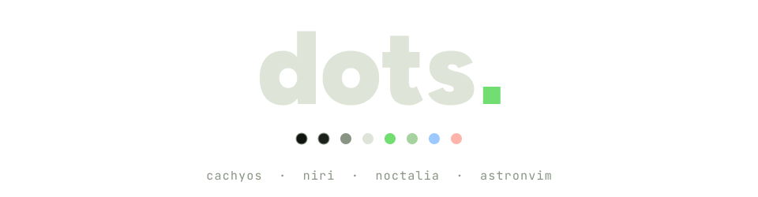
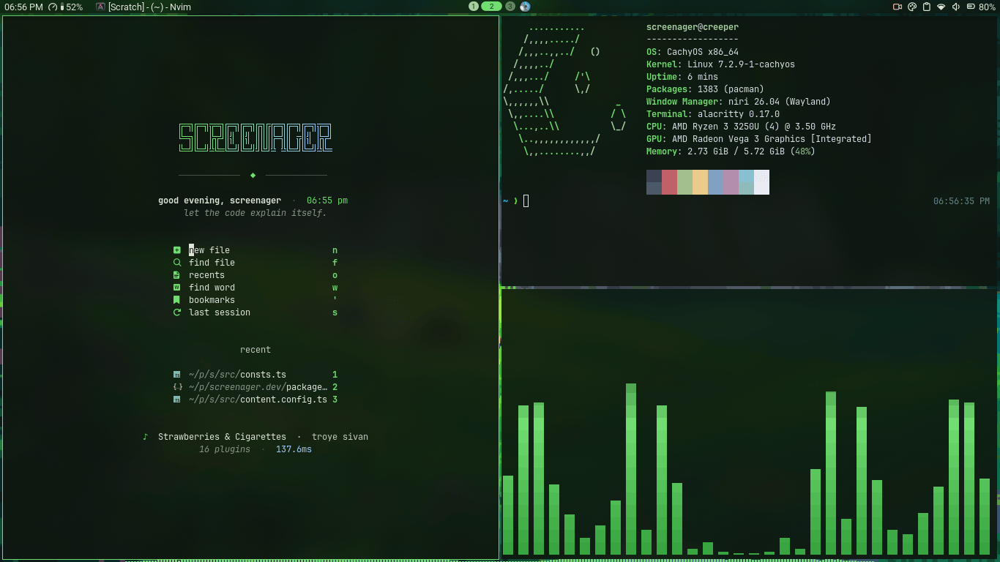
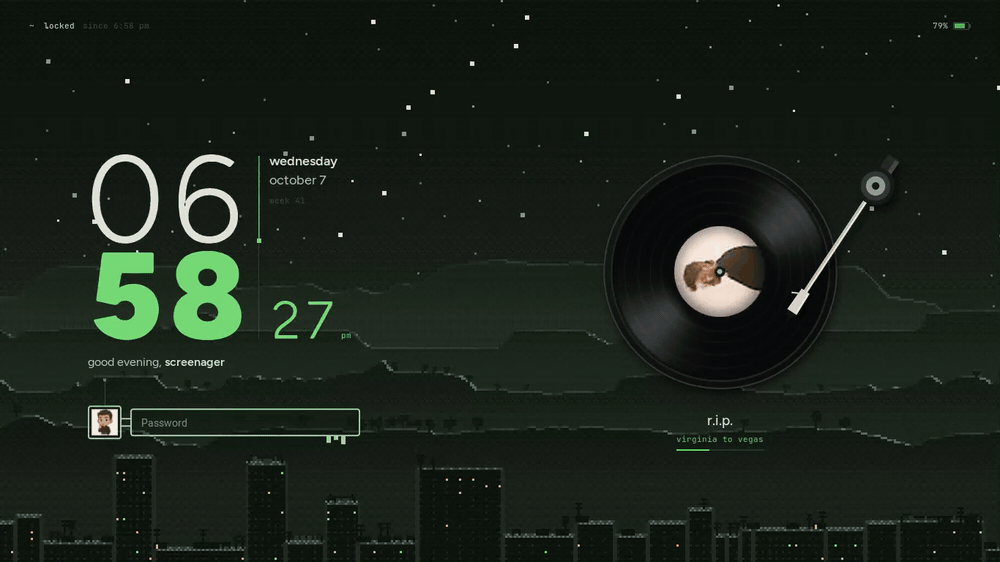
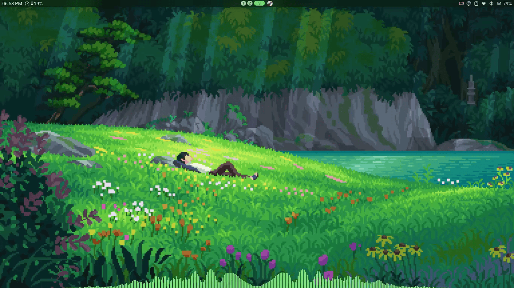
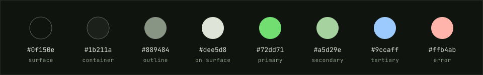

<div align="center">

<picture>
  <source media="(prefers-color-scheme: dark)" srcset="docs/header-dark.svg">
  <source media="(prefers-color-scheme: light)" srcset="docs/header-light.svg">
  
</picture>

<br>
<br>



<sub>workspace 2 · neovim, fastfetch, cava · 1366×768 · every colour taken from the wallpaper</sub>

<br>
<br>

A scrollable-tiling Wayland desktop for a two-core laptop with a small screen.<br>
Noctalia reads a palette off the wallpaper and writes it into everything else.<br>
The lock screen plays records.

<br>


</div>

<br>

## the lock screen

<picture>
  <source media="(prefers-reduced-motion: reduce)" srcset="docs/lockscreen.png">
  
</picture>

**Nocturne** is a lock-screen layout built from **Turntable**, a Noctalia plugin in this repo (1.5k lines of Luau).

- **record** — the current track's album art at 33⅓ rpm, with a tonearm that swings on and off. Labels are pre-rendered at 48 angles once per track and swapped by opacity, so spinning never decodes an image.
- **clock** — light hours over black minutes; every digit morphs outline-to-outline, breaking into dithered pixels halfway. Click the time to switch 12h / 24h.
- **key** — the password field dressed as a key, portrait on the bow. Click the bow to flip it and see how long the screen has been locked.
- **sky** — [screenager.dev](https://screenager.dev)'s pixel-art night, rendered by the site's own generator at exactly 1366×768.
- **cost** — ~30 updates a second while something moves, one a second when nothing does.

The same record, 18px wide, spins in the middle of the bar. Left click plays or pauses, right click skips, middle click goes back.

<details>
<summary>rebuild the layout or the artwork</summary>

<br>

```sh
cd ~/.local/share/noctalia/plugins/turntable/tools

# place the widgets: rewrites [lockscreen] and [lockscreen_widgets]
python3 nocturne_layout.py ~/.local/state/noctalia/settings.toml

# record body and tonearm frames
python3 render_assets.py

# the night sky (needs the screenager.dev source and brave)
./render_night.sh [seed-hex]
```

Needs `python-pillow`, `python-numpy` and `busctl` (systemd). The layout is measured for one 1366×768 output named `eDP-1`.

</details>

<br>

## palette





Material tones (`m3-content`) that Noctalia pulled from the meadow above. They are not hard-coded: change the wallpaper and the bar, borders, terminals, btop, cava, GTK, Qt, Zen, VS Code, Zed, Obsidian and Neovim all change with it. Neovim repaints live on `SIGUSR1`.

<br>

## what's inside

Each folder mirrors `$HOME`.

| package | |
| :-- | :-- |
| **`niri`** | Compositor config split into `cfg/*.kdl`. 4px gaps, square corners, a 1px focus ring, blur behind windows. `noctalia.kdl` is generated. |
| **`noctalia`** | Shell: an 18px bar, launcher, panels, notifications, idle and lid handling, theme templates. Includes the GUI-edited `settings.toml`. |
| **`turntable`** | The Noctalia plugin behind the lock screen and the bar's disc, plus its fonts (OFL). |
| **`nvim`** | AstroNvim v6. Everforest for code, wallpaper accents for the chrome, an animated start screen, CompetiTest for contests. |
| **`terminals`** | Alacritty (the one bound to a key), Kitty, Ghostty. Colours come from Noctalia. |
| **`zsh`** | CachyOS zsh config, a lean one-line Powerlevel10k, zoxide as `cd`. |
| **`tools`** | fastfetch, btop, cava, MangoHud. |
| **`git`** | Name, noreply email, `gh` as the credential helper. No tokens. |
| **`cp`** | Competitive-programming `template.cpp` and `debug.h`. |
| **`extras`** | Optional, never installed. See [below](#extras). |

<details>
<summary>neovim</summary>

<br>

- **start screen** — the SCREENAGER mark in a primary → tertiary gradient that a light sweeps across once, a greeting for the time of day, three recent files, the song playing, plugin count, startup time, git branch.
- **colours** — Everforest (hard, transparent) owns syntax. Floats, borders, the cursor line number and the indent scope follow the wallpaper; `SIGUSR1` swaps in the full Matugen base16 palette without a restart.
- **contests** — CompetiTest listens for Competitive Companion from launch and files problems as `<contest>/<A>.cpp` for Codeforces and AtCoder. clangd for C++, with Tree-sitter for the first C++ buffer deferred one tick so a contest file opens instantly.

| keys | |
| :-- | :-- |
| <kbd>Space</kbd> <kbd>r</kbd> <kbd>i</kbd> / <kbd>c</kbd> | receive problem / contest |
| <kbd>Space</kbd> <kbd>r</kbd> <kbd>r</kbd> | run test cases |
| <kbd>Space</kbd> <kbd>r</kbd> <kbd>a</kbd> / <kbd>e</kbd> | add / edit a test case |

</details>

<details>
<summary>noctalia</summary>

<br>

- **bar** — clock, CPU and the focused window on the left; workspaces and the spinning disc in the middle; tray and status on the right. 60% opacity over blur.
- **idle** — lock at 10 min, screen off at 11, suspend at 30. Closing the lid locks and suspends.
- **templates** — built-in: alacritty, btop, cava, gtk3, gtk4, niri, qt. Community: claude-code, codex, zen-browser, obsidian, vscode, zed, fastfetch, zathura. Own: VS Code Insiders and Neovim.
- **state** — `noctalia-state-watch.sh` (autostarted by niri) commits every write of `settings.toml` to a local git repo in `~/.local/state/noctalia`. Needs `inotify-tools`.

</details>

<br>

## install

```sh
git clone https://github.com/Tejas242/dots ~/dots
cd ~/dots
./install.sh --deps        # pacman + AUR packages, then every package into $HOME
```

```sh
./install.sh               # every package, no system packages
./install.sh nvim zsh      # only the ones you name
```

Files are **copied**, not symlinked: Noctalia rewrites `settings.toml` atomically, which would replace a symlink. Anything that would be overwritten moves to `~/.dots-backup/<timestamp>/` first. Then log out and back in.

On first start:

1. Noctalia renders its templates from the wallpaper (`noctalia.kdl`, terminal themes, `nvim/lua/matugen.lua`).
2. `nvim` bootstraps lazy.nvim and installs plugins.
3. Wallpaper paths in `theme.toml` and `settings.toml` are absolute (`/home/screenager/…`). Point them at your own home, or pick a wallpaper in Noctalia's settings.
4. The bar also uses three third-party Noctalia plugins that aren't in this repo: `oldirtty/color_picker`, `noctalia/screen_recorder` and `goodroot/noctwhspr`. Install them or drop them from the bar.

<details>
<summary>packages</summary>

<br>

**`--deps` installs** &nbsp; `niri` `zsh` `zoxide` `neovim` `ripgrep` `fd` `git` `gcc` `rsync` `python-pillow` `python-numpy` `alacritty` `kitty` `ghostty` `fastfetch` `btop` `cava` `mangohud`, and `noctalia-git` from the AUR (via `paru` or `yay`).

**used by the configs, not installed** &nbsp; `cachyos-zsh-config` `zsh-theme-powerlevel10k` `ttf-jetbrains-mono-nerd` `ttf-roboto` `inotify-tools` `brightnessctl` `zen-browser` `youtube-music` `nautilus`

</details>

<br>

## keys

<details>
<summary>niri · <kbd>Mod</kbd> is Super · <kbd>Mod</kbd> <kbd>Shift</kbd> <kbd>Esc</kbd> lists all of them</summary>

<br>

| keys | |
| :-- | :-- |
| <kbd>Mod</kbd> <kbd>Return</kbd> | terminal |
| <kbd>Mod</kbd> <kbd>A</kbd> | launcher |
| <kbd>Mod</kbd> <kbd>B</kbd> · <kbd>M</kbd> · <kbd>E</kbd> | browser · music · files |
| <kbd>Mod</kbd> <kbd>H</kbd> <kbd>J</kbd> <kbd>K</kbd> <kbd>L</kbd> | focus column left · window down · window up · column right |
| <kbd>Mod</kbd> <kbd>Ctrl</kbd> <kbd>H</kbd> <kbd>J</kbd> <kbd>K</kbd> <kbd>L</kbd> | move them |
| <kbd>Mod</kbd> <kbd>1</kbd>–<kbd>9</kbd> | workspace |
| <kbd>Mod</kbd> <kbd>Ctrl</kbd> <kbd>1</kbd>–<kbd>9</kbd> | send column to workspace |
| <kbd>Mod</kbd> <kbd>Tab</kbd> | previous workspace |
| <kbd>Mod</kbd> + wheel | workspaces; with <kbd>Shift</kbd>, columns |
| <kbd>Mod</kbd> <kbd>-</kbd> / <kbd>=</kbd> | column width ∓10%; with <kbd>Shift</kbd>, window height |
| <kbd>Mod</kbd> <kbd>C</kbd> | centre column |
| <kbd>Mod</kbd> <kbd>Ctrl</kbd> <kbd>F</kbd> | fill the available width |
| <kbd>Mod</kbd> <kbd>W</kbd> | tabbed column |
| <kbd>Mod</kbd> <kbd>T</kbd> · <kbd>F</kbd> | float · fullscreen |
| <kbd>Mod</kbd> <kbd>O</kbd> | overview |
| <kbd>Mod</kbd> <kbd>Q</kbd> | close window |
| <kbd>Mod</kbd> <kbd>Alt</kbd> <kbd>L</kbd> | lock |
| <kbd>Mod</kbd> <kbd>Shift</kbd> <kbd>Q</kbd> | session menu |
| <kbd>Ctrl</kbd> <kbd>Shift</kbd> <kbd>1</kbd> · <kbd>2</kbd> · <kbd>3</kbd> | screenshot region · screen · window |
| <kbd>Ctrl</kbd> <kbd>Alt</kbd> <kbd>Delete</kbd> | quit niri |

</details>

<br>

## sync

Edit configs where they live, then pull them back into the repo:

```sh
cd ~/dots
./sync.sh                  # or: ./sync.sh nvim noctalia
git add -A && git commit -m "sync" && git push
```

The `PACKAGES` table at the top of `sync.sh` is the list of tracked paths; add one there to start tracking it. On the way in, `sync.sh` swaps the git email for the GitHub noreply address and blanks the weather location.

<br>

## extras

`extras/niri/nocturne.kdl` is a heavier niri overlay, tuned for a Vega 3:

- windows open by growing out of a small pill into a card, and close like a CRT switching off (custom shaders)
- slightly under-damped springs, so motion lands softly
- a `#72dd71 → #8fd3c8` gradient focus ring, 6px corners, blur only behind terminals

Copy it next to `config.kdl` and add `include "./nocturne.kdl"` as the last line. Remove the line to undo.

<br>

<div align="center">


<br>
<br>

<sub>
<a href="https://github.com/YaLTeR/niri">niri</a> ·
<a href="https://github.com/noctalia-dev/noctalia">noctalia</a> ·
<a href="https://github.com/AstroNvim/AstroNvim">astronvim</a> ·
wallpaper from a GitHub collection that doesn't know who painted it either
</sub>

<br>

<sub>the long version, with a rubber duck: <a href="https://screenager.dev/setup">screenager.dev/setup</a></sub>

</div>
